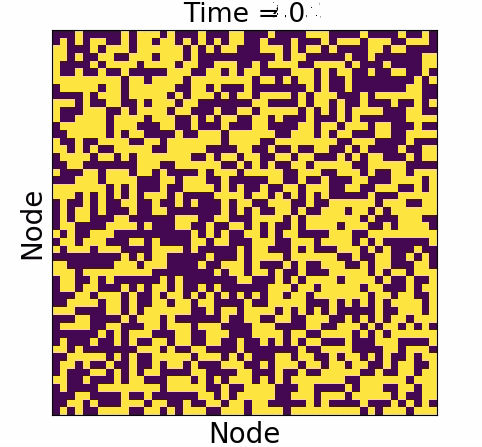
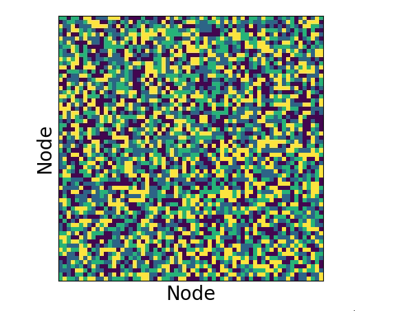
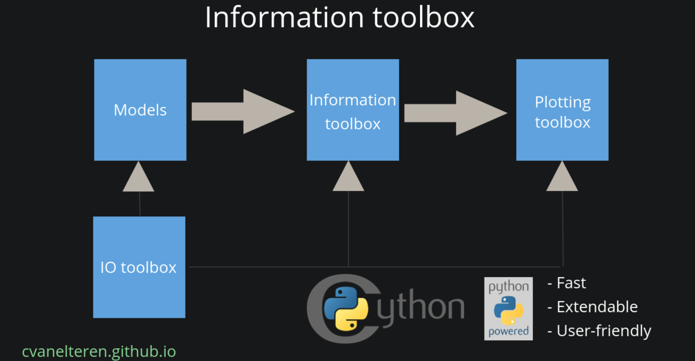

# Introduction

Information toolbox for analyzing complex dynamical systems. The goal of the packages is to provide a general and fast framework for computational scientists to use in addition to providing methods to compute informational impact. The package was written as part of my master thesis and the accompaning paper can be found [here](https://arxiv.org/abs/1904.06654).
## Requirements
### System
- Openmp >= 8.0.0.0-1
- clang >= 8.0.0-3
### Python
- See `requirements.txt`
### Optional
- `Jupyter` for viewing of notebooks

# Install instructions
To install the package run:

`python setup.py build_ext --inplace`
TODO: update this

## Overview
The main division can be found as follows:
- Modeling
- Methods
- Plotting
Please note that a unittest is written for nearly every different main file

# Models
Current implemented models:
<!--  -->

    

    
    

    

    
    

## Modules

- Models: contains various models
- Utils: various different statistical, plotting and IO related functions
- Toolbox: the 'engine' responsible for Monte-Carlo methods

# TODO:
- General: clean up code; remove redundant information.
- move fastIsing in the models.py for cleaner outlook
- Expand the toolbox to be able to be used by experimentalists
- Give confounder estimate
- Train classifier with less features
- Account for interaction effects with ols
